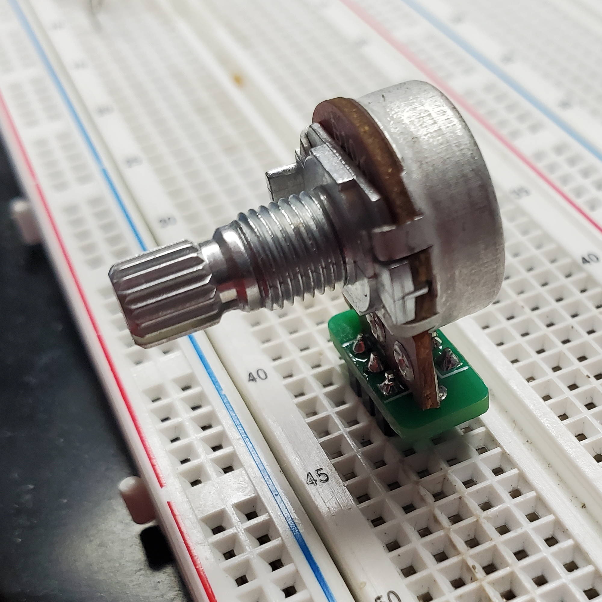
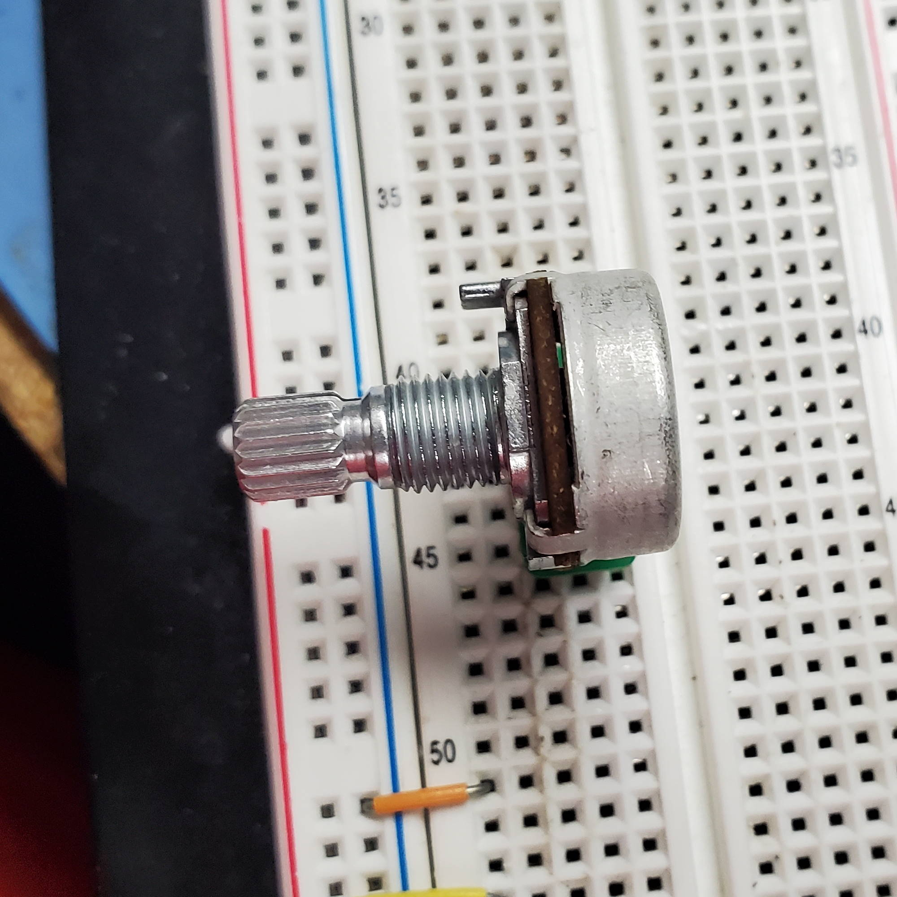
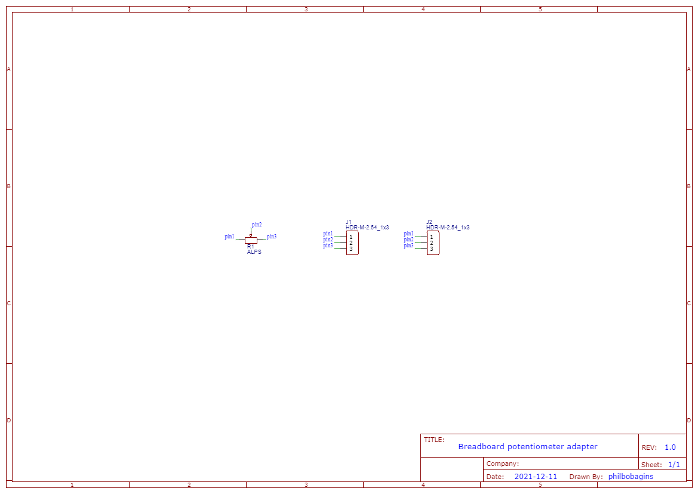

Breadboard potentiometer adapter
================================

A tiny little board to make it easier to plug a potentiometer into a breadboard.

Licence
-------

Copyright © 2022 Phil Baldwin

This work is licensed under a Creative Commons Attribution-ShareAlike 4.0 International License.

You should have received a copy of the license along with this work. If not, see <http://creativecommons.org/licenses/by-sa/4.0/>.
